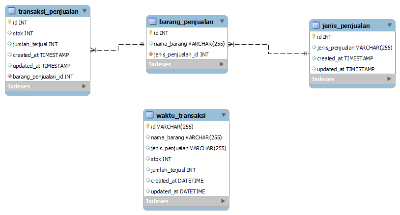
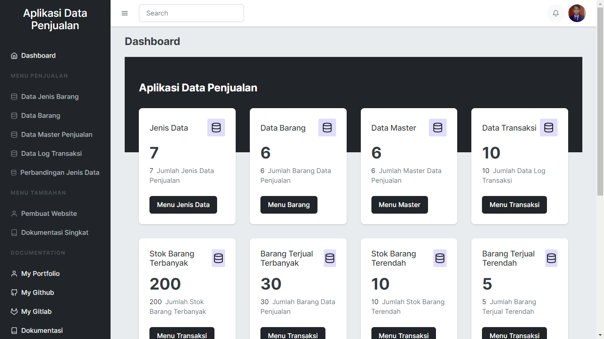
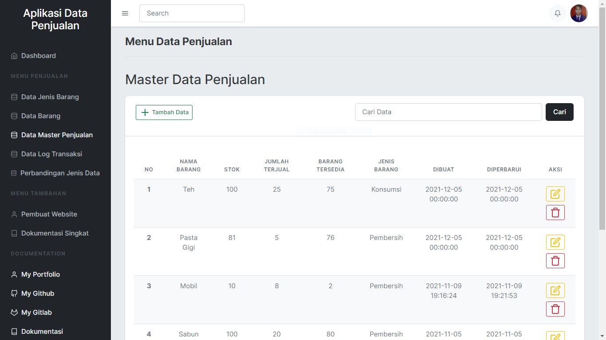

# Aplikasi Berbasis Web Data Penjualan dengan Laravel 8

Membuat Aplikasi Berbasis Web Data Penjualan Menggunakan Laravel 8, Yang Bertujuan Untuk Presentasi Kepada Tester. Aplikasi Berbasis Web Data Penjualan dengan Laravel 8 adalah aplikasi yang berfungsi untuk melakukan pendataan barang.

## Siapa pembuat aplikasi ini?
|----------------|----------------------|
| Nama           | Bagus Budi Satoto    |
| Jurusan        | S1 - Informatika     |
| Universitas    | Amikom Yogyakarta    |


## Desain ERD



<h3>Notes : </h3>

<b>Jenis Penjualan : </b>Digunakan untuk menyimpan data jenis penjualan.

<b>Transaksi Penjualan : </b>Digunakan untuk menyimpan data transaksi penjualan. (Master Data Penjualan).

<b>Barang Penjualan : </b>Digunakan untuk menyimpan data barang penjualan.

<b>Waktu Transaksi : </b>Digunakan untuk menyimpan data kapan waktu transaksi.

## Foto Aplikasi Data Penjualan





## Cara Instalasi ke Server Lokal :

-   Follow Github Saya
-   Star Repo Github Saya
-   Fork Repo Github Saya
-   Clone project repo saya dengan cara menuliskan pada terminal/cmd/git bash :<br> <b>git clone</b>
``````
https://github.com/bagussatoto/Aplikasi-Data-Penjualan-Laravel-8.git
`````` 
-   lalu masuk ke direktori repo yg sudah di clone dengan ketik lg pada terminal/cmd/git bash <b>cd aplikasi_data_penjualan</b>
-   lalu ketik <b>composser install </b> dan <b>php artisan key generate</b>
-   tulis migrate database pada terminal/cmd/git bash : <b>php artisan migrate:install</b>
-   jalankan php artisan db:seed pada terminal/cmd/git bash : <b>php artisan db:seed</b>

<b>Notes :</b> Untuk db:seed jika males untuk mengetikan data, akan dibuatkan langsung oleh laravelnya.

## Fitur Aplikasi

-   Halaman Utama (Halaman Dashboard)<br><br>

A. Menu Data Jenis Barang<br>

-   Tambah Data (Data Jenis Barang)<br>
-   Ubah Data (Data Jenis Barang)<br>
-   Hapus Data (Data Jenis Barang)<br>

B. Menu Data Master Penjualan<br>

-   Tambah Data (Data Master Penjualan)<br>
-   Ubah Data (Data Master Penjualan)<br>
-   Hapus Data (Data Master Penjualan)<br>

C. Menu Data Log Transaksi<br>

-   Reset Data (Data Log Transaksi)<br>

D. Menu Perbandingan Jenis Data

E. Menu Tambahan

-   Pembuat Website
-   Dokumentasi Singkat

## Alat Yang Digunakan Untuk Membuat Web :

-   WAMP
-   Visual Studio Code
-   Git
-   Cloud (Github)
-   PHP 7.4.9
-   MYSQL 8.0.13
-   Laravel 8
-   Bootstrap 5
-   Composer


## Kritik dan Saran

| *_Silahkan kirim kritik dan saran anda ke email :_*  |
|------------------------------------------------------|
| bagusbudi1308@gmail.com                              |


## Request Fitur Baru dan Pelaporan Bug

Anda dapat meminta fitur baru maupun melaporkan bug melalui menu **issues** yang sudah disediakan oleh GitHub (lihat menu di atas), posting issues baru dan kita akan berdiskusi disana.


## Berkontribusi

Siapapun dapat berkontribusi pada proyek ini mulai dari pemrograman, pembuakan buku manual, sampai dengan mengenalkan produk ini kepada Mahasiswa 
Untuk belajar agar mengurangi kesenjangan pendidikan teknologi dengan cara membuat postingan issue di repository ini.

<p align="center"><a href="https://laravel.com" target="_blank"></a></p>

<p align="center">
<a href="https://travis-ci.org/laravel/framework"></a>
<a href="https://packagist.org/packages/laravel/framework"></a>
<a href="https://packagist.org/packages/laravel/framework"></a>
</p>


